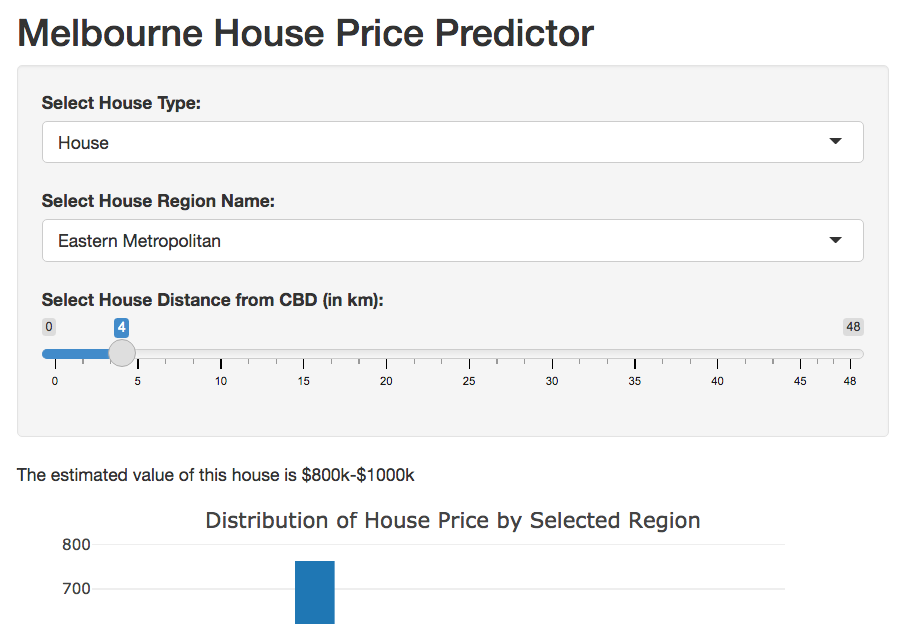

cautious-chainsaw
========================================================
author: Ivan Jennings
date: 19-04-2021
autosize: true

What is cautious-chainsaw?
========================================================

cautious-chainsaw is a simple prediction app hosted on the shiny apps website.

- Enter basic house details
- The shiny app will produce a prediction
- Dynamically updates when selection features

Interface
========================================================




Dynamic Plot
========================================================

The plot included on the app is based on the following data


```r
house_price_table <- read.csv("house_price_table.csv", row.names = 1)
head(house_price_table, n=10)
```

```
                   Regionname       Price Freq
1        Eastern Metropolitan   $0k-$200k    0
2            Eastern Victoria   $0k-$200k    0
3       Northern Metropolitan   $0k-$200k    3
4           Northern Victoria   $0k-$200k    0
5  South-Eastern Metropolitan   $0k-$200k    0
6       Southern Metropolitan   $0k-$200k    3
7        Western Metropolitan   $0k-$200k    8
8            Western Victoria   $0k-$200k    0
9        Eastern Metropolitan $200k-$400k   14
10           Eastern Victoria $200k-$400k    2
```

Conclusion
========================================================

This is a simple app that can quickly provide an estimate of a house price in Melbourne.

Check it out: https://ivanjjj.shinyapps.io/cautious-chainsaw/

Credit to anthonypino for the data source: https://www.kaggle.com/anthonypino/melbourne-housing-market
